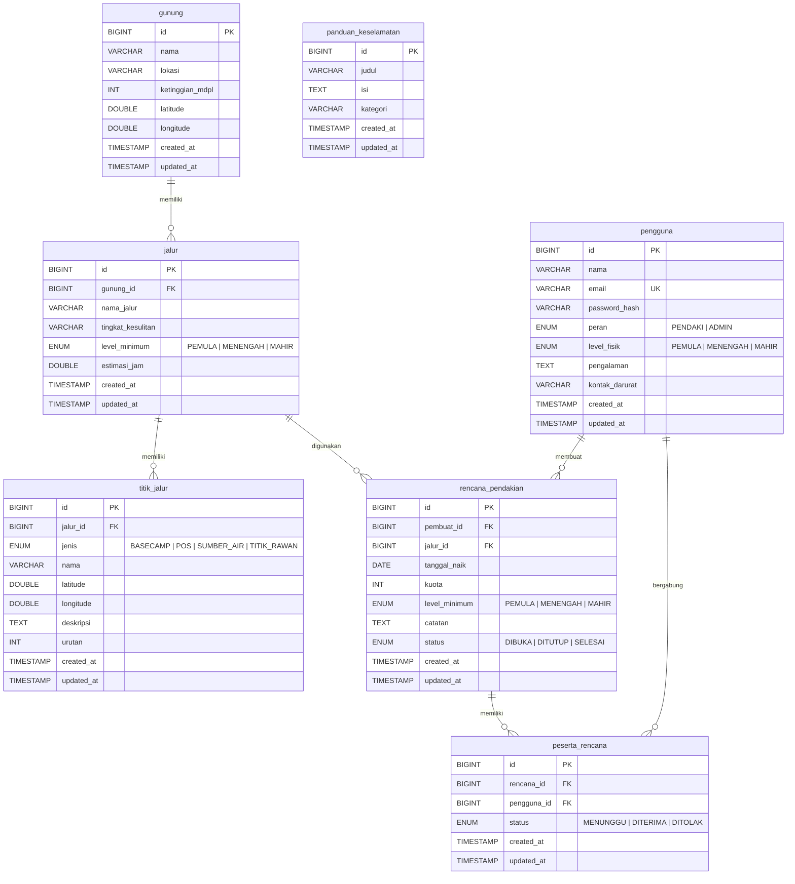

# Entity Relationship Diagram — KawanNaik

```mermaid
erDiagram
    pengguna {
        BIGINT id PK
        VARCHAR nama
        VARCHAR email UK
        VARCHAR password_hash
        ENUM peran "PENDAKI | ADMIN"
        ENUM level_fisik "PEMULA | MENENGAH | MAHIR"
        TEXT pengalaman
        VARCHAR kontak_darurat
        TIMESTAMP created_at
        TIMESTAMP updated_at
    }

    gunung {
        BIGINT id PK
        VARCHAR nama
        VARCHAR lokasi
        INT ketinggian_mdpl
        DOUBLE latitude
        DOUBLE longitude
        TIMESTAMP created_at
        TIMESTAMP updated_at
    }

    jalur {
        BIGINT id PK
        BIGINT gunung_id FK
        VARCHAR nama_jalur
        VARCHAR tingkat_kesulitan
        ENUM level_minimum "PEMULA | MENENGAH | MAHIR"
        DOUBLE estimasi_jam
        TIMESTAMP created_at
        TIMESTAMP updated_at
    }

    titik_jalur {
        BIGINT id PK
        BIGINT jalur_id FK
        ENUM jenis "BASECAMP | POS | SUMBER_AIR | TITIK_RAWAN"
        VARCHAR nama
        DOUBLE latitude
        DOUBLE longitude
        TEXT deskripsi
        INT urutan
        TIMESTAMP created_at
        TIMESTAMP updated_at
    }

    rencana_pendakian {
        BIGINT id PK
        BIGINT pembuat_id FK
        BIGINT jalur_id FK
        DATE tanggal_naik
        INT kuota
        ENUM level_minimum "PEMULA | MENENGAH | MAHIR"
        TEXT catatan
        ENUM status "DIBUKA | DITUTUP | SELESAI"
        TIMESTAMP created_at
        TIMESTAMP updated_at
    }

    peserta_rencana {
        BIGINT id PK
        BIGINT rencana_id FK
        BIGINT pengguna_id FK
        ENUM status "MENUNGGU | DITERIMA | DITOLAK"
        TIMESTAMP created_at
        TIMESTAMP updated_at
    }

    panduan_keselamatan {
        BIGINT id PK
        VARCHAR judul
        TEXT isi
        VARCHAR kategori
        TIMESTAMP created_at
        TIMESTAMP updated_at
    }

    gunung ||--o{ jalur : "memiliki"
    jalur ||--o{ titik_jalur : "memiliki"
    jalur ||--o{ rencana_pendakian : "digunakan"
    pengguna ||--o{ rencana_pendakian : "membuat"
    rencana_pendakian ||--o{ peserta_rencana : "memiliki"
    pengguna ||--o{ peserta_rencana : "bergabung"
```
